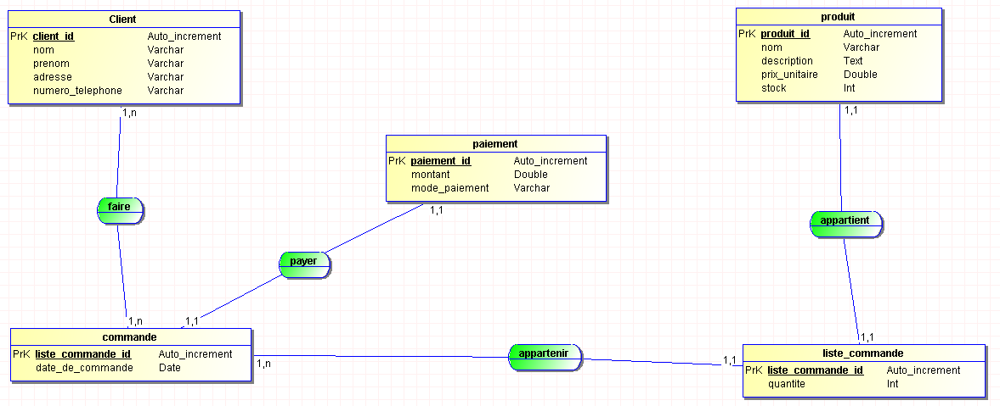

# EXAMEN FINAL PROG2

## Gestion des ventes d'une entreprise

This application was created to manage the sales of a company

- **MCD used**

- **App used**
    - Data Base: PostgreSQL
    - Back-End: Spring Boot, Java 20
    - Maven
    - JDBC Driver
- **Installation**
    - You must Clone this repository, used this command: **git clone https://github.com/junkaM/examen_crud.git**
    - Run the file **examenProg2.sql** in the folder **baseDeDonnee**
    - Run the application **CrudApplication** in **src/main/java/com.examen.crud** with your software favorite (ex: intellIJ, VSCode,..)
